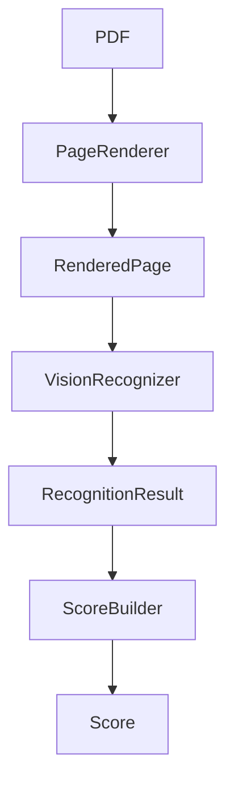

# Recognition Pipeline

## 1. 概要

認識パイプラインは、PDFの各ページを画像化し、Vision AIによる認識結果を、出力形式に依存しない`Score`ドメインへ段階的に変換するための境界である。

このパイプラインでは、AIの出力を直接`Score`へ変換しない。AIから得た不完全・曖昧な情報をまず`RecognitionResult`として保持し、その後の`ScoreBuilder`で音楽的な解釈、正規化、検証を行う。この中間境界により、認識時点で情報を早期に捨てず、Provider固有表現と厳密なドメインモデルを分離できる。



実装上、`PageRenderer`は`PDFLoader`が読み込み・必要に応じて復号した`PDFDocument`を受け取る。図では認識処理全体を簡潔に示すため、その入力を「PDF」と表記している。

## 2. コンポーネントの責務

### PageRenderer

- **入力:** 復号済みPDFデータを保持する`PDFDocument`、DPI、任意のページ番号群
- **出力:** `RenderedPage`のタプル
- **責務:** `PDFDocument.content`を使い、指定ページをメモリ上でPNGへ変換する。ページ番号、画像サイズ、DPIを結果へ付与し、PDFのページ数とメタデータの整合も確認する。
- **責務外:** PDFの再読込やパスワード処理、OCR、画像前処理、譜面認識、音楽的解釈。

`PageRenderer`が画像化に限定されることで、Vision ProviderはPDFライブラリや暗号化方式を意識せず、画像だけを入力として扱える。

### RenderedPage

- **入力:** `PageRenderer`が生成したページ番号、PNGバイト列、幅、高さ、DPI、メディアタイプ
- **出力:** `VisionRecognizer`へ渡す不変なページ単位データ
- **責務:** 1ページ分の画像と、その画像をProvider入力へ変換するために必要なメタデータを保持する。
- **責務外:** 画像の解析、認識状態の保持、Provider設定、複数ページの集約。

ページ単位の値オブジェクトにすることで、認識処理の実行単位とページ番号の対応が明確になる。外部ライブラリ固有の画像オブジェクトは公開せず、`bytes`と基本型だけを使う。

### VisionRecognizer

- **入力:** 単一の`RenderedPage`
- **出力:** 入力ページに対応する`RecognizedPage`を1件だけ含む`RecognitionResult`
- **責務:** Providerへページ画像を送信し、応答が構造的に解析可能であることを確認して、Provider非依存モデルへ変換する。入力と出力のページ番号が一致することも保証する。
- **責務外:** 複数ページの実行・集約、認識履歴や進捗の保持、`Score`生成、楽器マッピング、音楽的妥当性の判定。

この境界は「AIとの通信」と「音楽ドメインへの確定」を分離する。Vision AIが返す未知・欠落・低信頼度の情報は、構造的に表現できる限り拒否せず保持する。

### RecognitionResult

- **入力:** Provider応答から変換されたページ、パート、小節、イベント、信頼度、警告、位置情報
- **出力:** `ScoreBuilder`が解釈できるProvider非依存の認識結果
- **責務:** 認識された事実と不確実性を、不変なPythonモデルとして保持する。型、必須のコンテナ構造、基本的な値域などの構造的制約を検証する。
- **責務外:** `DrumInstrument`への対応付け、欠落情報の補完、イベント整列、小節容量、拍子の音楽的妥当性、`Score`への変換。

`RecognitionResult`はAIの生レスポンスでも完成済みの楽譜でもない。Providerの違いを吸収しながら、後続処理が判断に使える未知の楽器名、任意の信頼度、警告と発生位置を保持する中間契約である。レンダリング画像自体は保持しない。

### ScoreBuilder

- **入力:** `RecognizedPage`を1件だけ含む`RecognitionResult`
- **出力:** 既存の不変条件を満たす`Score`、または位置情報を持つ`ScoreBuildError`
- **責務:** 認識結果を音楽ドメインとして解釈し、明示的な楽器ラベルの`DrumInstrument`へのマッピング、イベントの安定ソート、小節容量や必須情報の検証を行う。
- **責務外:** 複数ページの結合、欠落した拍子・小節番号・パート名の推測、Provider API通信、Prompt生成、画像レンダリング、Exporter固有の検証。

Issue #17のMVPではCross-page reconstructionや認識誤りの自動修正を行わない。変換不能な欠落・矛盾・未知の楽器は、元ページ上の位置を示す例外として報告する。

### Score

- **入力:** ScoreBuilderなど、ドメイン変換処理が確定したパート、小節、拍子、テンポ、音符、休符
- **出力:** MusicXML ExporterやMIDI Exporterが利用する出力形式非依存の楽譜モデル
- **責務:** 完成した楽譜の不変条件を保持する。現在のモデルは、パートと小節の存在、正の小節番号と昇順、2の累乗である拍子分母、イベントの小節内収容、既知の`DrumInstrument`などを検証する。
- **責務外:** 認識結果の曖昧性保持、Provider固有処理、画像処理、MusicXML・MIDI固有表現の生成。

`Score`を厳密なモデルとして保つため、認識直後の不完全なデータを直接入れず、RecognitionResultとScoreBuilderを境界として設けている。

## 3. Validation Boundary

### RecognitionResultまでで保証すること

RecognitionモデルとVisionRecognizerは、外部データを安全にPython上で表現できるところまでを保証する。

- 認識モデルは`frozen=True, slots=True`のdataclassであり、生成後に変更できない。
- ページ、パート、小節、イベント、警告などが所定の型とタプル構造を持つ。
- ページ番号や任意の小節番号は正の整数である。
- オフセットは非負、音符と休符の長さは正であり、分数の分母は正である。
- `RecognizedFraction`のoffsetとdurationは`Score`と同じ四分音符単位である。四分音符は`1`、八分音符は`1/2`、十六分音符は`1/4`であり、4/4小節の容量は`4`となる。
- velocityは指定される場合に0から127、confidenceは指定される場合に有限な0.0から1.0である。
- `RecognitionResult.pages`は空でなく、ページ番号が重複せず昇順である。
- 警告位置のpart、measure、eventインデックスは階層関係を満たす。
- VisionRecognizerの1回の呼び出し結果は1ページだけを含み、入力ページ番号と一致する。
- Provider応答が構文的・構造的に解析でき、認識モデルへ変換できる。

一方で、次の状態は構造的に表現可能であれば有効な認識結果として保持する。

- 小節番号、拍子、パート名の欠落
- 未知の楽器ラベル
- 空のページ、パート、小節
- 並び替えられていないイベント
- 小節の想定容量を超えるイベント
- 2の累乗とは限らない拍子分母
- 低い信頼度、曖昧性、認識警告

ここで検証を止める理由は、AIの不完全な観測と音楽的な誤りを区別し、後続処理が元情報を参照して判断できるようにするためである。

### ScoreBuilder以降で保証すること

ScoreBuilderと後続のドメイン検証は、認識結果を演奏・出力可能な楽譜として確定する責務を持つ。

- 未知の楽器ラベルを`DrumInstrument`へ解釈・マッピングする。
- 欠落したパート名、小節番号、拍子を推測で補完せず、変換エラーとして扱う。
- イベント順序を必要に応じて正規化する。
- 各イベントが小節容量内に収まることを確認する。
- 拍子分母など、`Score`が要求する音楽ドメイン上の制約を確認する。
- 単一ページの認識結果を変換し、複数ページは後続の再構築処理へ委ねる。
- 最終的に不変条件を満たす`Score`を生成する。

この二段階の検証により、Provider応答の構造エラーは認識層で、音楽としての不整合はドメイン変換層で報告できる。

## 4. VisionRecognizer

### 公開API

`VisionRecognizer`は`typing.Protocol`として定義されたProvider非依存の契約である。

```python
class VisionRecognizer(Protocol):
    async def recognize(self, page: RenderedPage) -> RecognitionResult:
        ...
```

`recognize()`を非同期にすることで、Providerとの待ち時間を呼び出し側が管理できる。ただし、複数ページを逐次実行するか並行実行するか、結果をどのように集約するかは呼び出し側が決定する。

Protocolの引数と戻り値はプロジェクト所有型だけで構成される。Provider SDK型やProvider設定を共通インターフェースへ持ち込まないため、パイプラインの利用側は具体的Providerを意識せず差し替えられる。

### 例外体系

公開境界から送出する認識例外は、次のプロジェクト所有型に統一される。

```text
RecognitionError
├── ConfigurationError
├── AuthenticationError
├── CommunicationError
├── ProviderResponseError
├── RecognitionConversionError
└── InternalRecognitionError
```

- `ConfigurationError`: 必須設定の不足や不正な設定値
- `AuthenticationError`: 認証情報の不足、認証・認可失敗
- `CommunicationError`: タイムアウト、ネットワーク、Provider通信失敗
- `ProviderResponseError`: Provider応答の構文・構造を解析できない場合
- `RecognitionConversionError`: 解析済みデータを認識モデルへ変換できない場合
- `InternalRecognitionError`: 上記に分類できない想定外の失敗

Providerや標準ライブラリ由来の例外はこの体系へ変換され、想定外の例外は`InternalRecognitionError`のcauseとして保持される。既存の`RecognitionError`は包み直さない。例外メッセージにはAPIキー、Authorizationヘッダー、画像バイト列、Base64画像、完全な要求・応答を含めない。

### ステートレス設計

Recognizerインスタンスは再利用可能な設定とTransportを保持するが、ページ固有の認識結果、履歴、進捗は保持しない。各`recognize()`は単一の`RenderedPage`から単一ページの結果を独立して生成する。

この設計により、呼び出し側は同じインスタンスを安全に複数ページへ利用しつつ、逐次処理、並行処理、失敗時の再実行といった実行方針をRecognizerから独立して選択できる。

### Provider依存部の分離

`VisionRecognizer`自身にはProvider固有設定を含めない。具体実装はコンストラクタでProvider専用設定を受け取り、認証・通信・応答形式を内部に閉じ込める。戻り値と公開例外は常にプロジェクト所有型へ変換される。

## 5. OpenAI実装

`OpenAIVisionRecognizer`はOpenAI Responses APIを利用する具体実装である。メインモジュールは処理順序と公開例外への変換を担当し、現在存在する四つの処理責務を内部モジュールへ分離している。

### Request生成

`_openai_vision_request.py`がPrompt、画像Data URL、Structured Output用JSON Schemaを組み立てる。Promptは、欠落値や未知の楽器を推測で補完せず、構造的に表現できる認識情報を保持するよう求める。

Request生成を通信から分離することで、画像とページ番号から何が送信されるかを外部APIなしで検証できる。また、SchemaはRecognitionResultまでの構造境界を表し、Scoreの音楽的制約は含めない。

### Transport

`_openai_vision_transport.py`が`OpenAIConfig`、Transport Protocol、標準ライブラリによるHTTP通信を担当する。APIキー、モデル、HTTPSエンドポイント、タイムアウトを検証し、HTTPやネットワークの失敗を内部的な失敗分類へ変換する。

Transportを独立させることで、テストでは実通信を行わず差し替えられる。認証情報は設定から受け取り、Request本文、例外メッセージ、認識結果には保持しない。

### Response解析

`_openai_vision_response.py`の`parse_openai_response()`がResponses APIの外側の応答構造を検査し、`output_text`からJSONオブジェクトを抽出する。失敗・未完了・拒否・構造不正は`ProviderResponseError`として扱う。

この段階はOpenAIの応答形式を理解するが、RecognitionResultの各モデルはまだ生成しない。Provider形式の解析失敗とモデル変換失敗を区別するための境界である。

### RecognitionResult変換

同モジュールの`convert_openai_data()`が解析済みのProviderデータを`RecognizedPage`、`RecognizedPart`、`RecognizedMeasure`、`RecognizedNote`、`RecognizedRest`、警告などへ変換する。

変換時にはプリミティブ型と入力ページ番号との一致を確認し、結果のページを必ず1件にする。一方、未知の楽器ラベル、欠落可能な値、空の構造、低信頼度などはRecognitionモデルが許容する範囲で保持し、`Score`や`DrumInstrument`へは変換しない。

`openai_vision_recognizer.py`はこれらをRequest生成、Transport、Response解析、RecognitionResult変換の順で呼び出し、外部例外を公開例外体系へ統一する。各段階を個別にテスト可能にしながら、公開APIは`OpenAIVisionRecognizer.recognize()`へ集約されている。

## 6. 将来のProvider拡張

GeminiやClaudeなどを追加する場合、Provider非依存の`VisionRecognizer` Protocolを実装し、そのProvider専用の設定、入力構築、Transport、応答解析、RecognitionResult変換を実装側へ閉じ込める。

新しい実装が次の契約を守れば、PageRenderer、RenderedPage、RecognitionResult、およびScoreBuilderを変更する必要はない。

- 単一の`RenderedPage`を非同期に受け取る。
- 入力ページと同じ番号の`RecognizedPage`を1件だけ返す。
- Provider固有型を公開境界へ出さない。
- 失敗をプロジェクト所有の認識例外へ変換する。
- 構造的に表現可能な不完全・未知・曖昧な情報を保持する。
- Score生成や音楽的検証を行わない。

したがって、Provider追加は新しいVisionRecognizer具体実装とそのProvider設定の追加に限定でき、認識パイプラインの境界や後続のドメイン処理は共通のまま維持できる。
